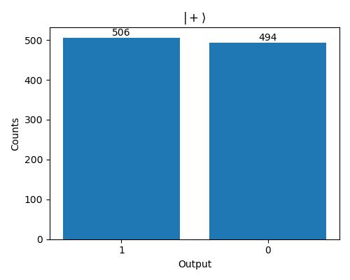
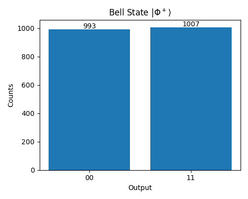
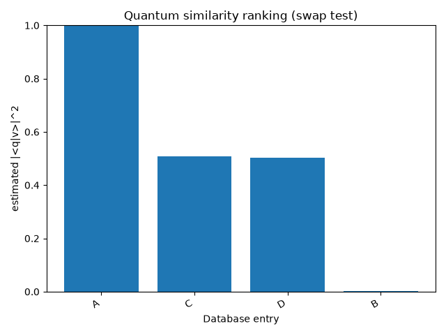
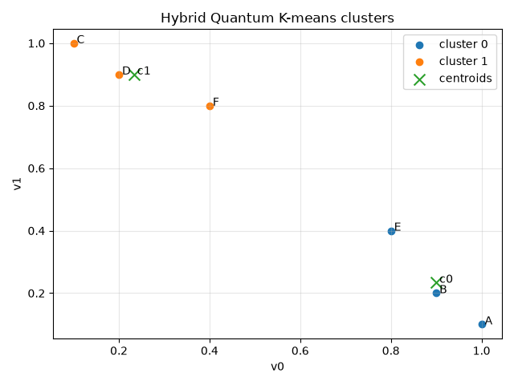
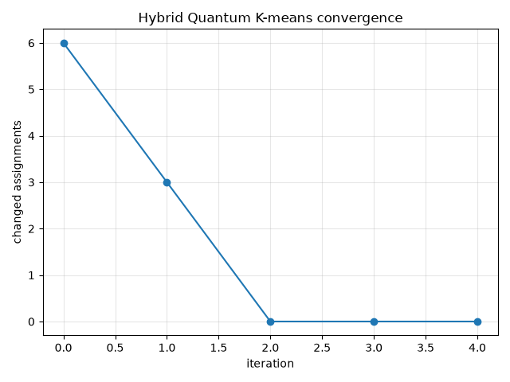

# Outputs and reports for the first week assignment of HCLAB Quantum Computing

Team: 
    HCLAB3

Members:
    - Matin Heidari Khayat
    - Joshua Heitbreder

## Task1 - Environment Setup Check
### Output:
```
Counts: {'0': 10}
```

## Task2 -  Single-Qubit Playground
### Output:
```
{'0': 1000}

{'1': 1000}

{'1': 506, '0': 494}
```
 result" width="400">

### Explanation
Measurement frequencies approximate the theoretical probabilities predicted by quantum mechanics. The states |0⟩ and |1⟩ always produce outcomes 0 and 1 respectively, while |+⟩ produces 0 and 1 with approximately equal frequency. Small deviations from the expected probabilities occur because only a finite number of shots are measured.

## Task3 - Two Qubits & Bell State
### Output:
```
Basis State |00>
{'00': 2000}

Basis State |01>
{'01': 2000}

Basis State |10>
{'10': 2000}

Basis State |11>
{'11': 2000}

Bell State |Φ⁺>
{'00': 993, '11': 1007}
```


## Task4 - Angle Encoding
### Output:
| x    | θ (rad) | Theory p(1) | Empirical p(1) |
| ---- | ------- | ----------- | -------------- |
| 0.00 | 0.000   | 0.000       | 0.000          |
| 0.25 | 0.785   | 0.146       | 0.150          |
| 0.50 | 1.571   | 0.500       | 0.483          |
| 0.75 | 2.356   | 0.854       | 0.835          |
| 1.00 | 3.142   | 1.000       | 1.000          |


### Explanation:
The empirical frequencies closely matched the theoretical probabilities for all tested values of (x). For example, the predicted probabilities of 0.146, 0.500, and 0.854 corresponded to observed frequencies of 0.150, 0.483, and 0.835, respectively. The small discrepancies are expected due to statistical fluctuations from using a finite number of measurement shots.

# Week 2: Quantum Similarity & Noise Sensitivity
The second week's assignment focuses on vector similarity via quantum overlaps and on how noise and circuit depth affect
results.
## Task 1 : Inner Products & Classical Comparison
Estimate the squared overlap |⟨x|y⟩|2
for several vector pairs using a swap test, and compare to
classical metrics.
### Results
|           | Squared Overlap | Cosine Similarity | Euclidian Distance |
| ----------| ----------------|-------------------|------------------- |
| identical | 1.0             | 1.0               | 0.0                |
| orthogonal| 0.012           | 0.0               | 1.414              |
| opposite  | 1.0             | -1.0              | 2.0                |
### Interpretation
 Swap test returns |⟨x|y⟩|2 (magnitude squared), cosine similarity is not squared and keeps sign information. In particular, (1, 0) and (−1, 0) have cosine similarity −1, but the same quantum
state up to global phase, so the overlap is 1. For the orthogonal pair, cosine similarity and squared overlap are both approximately zero, with squared overlap containing some noise. 
## Task 2: Tiny Quantum Classifier
Use the overlap estimator from Task 1 as a very small nearest-prototype classifier, and
compare it to a classical cosine-similarity classifier. The two classes are c0 = (1.0, 0.0), c1 = (0.0, 1.0).
### Results
| x          | Agreement | Overlap Squared Label | Cosine Label |
| -----------|-----------|-----------------------|--------------------------|
| (1.0, 0.0) | Yes       | ('0', 1.0, 0)         | ('0', 1.0, 0.0)
| (0.8, 0.2) | Yes       | ('0', 0.9475, 0.0425) | ('0', 0.9701, 0.2425)
| (0.2, 0.8) | Yes       | ('1', 0.0465, 0.946)  | ('1', 0.2425, 0.9701)
| (0.0, 1.0) | Yes       | ('1', 0, 1.0)         | ('1', 0.0, 1.0)
| (1.0, 1.0) | No        | ('1', 0.4755, 0.495)  | ('None', 0.7071, 0.7071)
| (1.0, -1.0 | Yes       | ('0', 0.516, 0.489)   | ('0', 0.7071, -0.7071)
### Interpretation
Both classifiers compare on different notions of similarity. Cosine Similarity compares directions, while the quantum classifier compares squared magnitudes
and looses sign information. The classifiers agree in most cases, except if (i) x is equally similar to both classes or (ii) The direction of x is opposite to a class vector.
In case (i), cosine similarity assigns no class label, whereas the quantum classifier assigns equal similarity to both and the noise steers the result more towards one class.
In case (ii), cosine similarity would be -1 and squared overlap would be 1 due to the loss of sign information.
## Task 3: The Swap Test
Show how overlap estimation degrades with increasing circuit depth under a depolarizing noise
model
### Results
We repeated the swap test with different circuit depths by constructing identity layers with double H gates and connecting them in series. The study shows that with more layers, noise accumulates and the overlap estimation decreases, deviating more and more from the true value.


# Week 3: Mini Project
This week we build on the Week 2 idea (overlap estimation via the swap test) to implement a tiny similarity
search: given a query vector and a small database of vectors, we compute similarity scores and rank
the database. Furthermore we implement our own hybrid quantum k-means and explore design choices regarding centroid initialization, 
the metric used for cluster assignment and handling the non-determinism that comes with quantum-based metrics.

## Similarity Search on a Tiny Database
How reliably (as a function of shots) can a swap-test similarity score identify the nearest vector in
a tiny 2D database? To answer this question, we conducted a similarity search over a set of vectors and recorded the results for different shots,
as shown by the table below. 

| shots | label |  v0 |   v1 | overlap_sq |
| ----: | :---- | --: | ---: | ---------: |
|   200 | A     | 1.0 |  0.0 |     1.0000 |
|   200 | B     | 0.0 |  1.0 |     0.0100 |
|   200 | C     | 1.0 |  1.0 |     0.4400 |
|   200 | D     | 1.0 | -1.0 |     0.5100 |
|   500 | A     | 1.0 |  0.0 |     1.0000 |
|   500 | B     | 0.0 |  1.0 |     0.0000 |
|   500 | C     | 1.0 |  1.0 |     0.4720 |
|   500 | D     | 1.0 | -1.0 |     0.4960 |
|  1000 | A     | 1.0 |  0.0 |     1.0000 |
|  1000 | B     | 0.0 |  1.0 |     0.0160 |
|  1000 | C     | 1.0 |  1.0 |     0.4880 |
|  1000 | D     | 1.0 | -1.0 |     0.4600 |
|  2000 | A     | 1.0 |  0.0 |     1.0000 |
|  2000 | B     | 0.0 |  1.0 |     0.0000 |
|  2000 | C     | 1.0 |  1.0 |     0.4890 |
|  2000 | D     | 1.0 | -1.0 |     0.5080 |
|  4000 | A     | 1.0 |  0.0 |     1.0000 |
|  4000 | B     | 0.0 |  1.0 |     0.0260 |
|  4000 | C     | 1.0 |  1.0 |     0.4895 |
|  4000 | D     | 1.0 | -1.0 |     0.5005 |

The following plot shows the final similarities:


It was observed that the same labels are assigns for all shot counts, but the scores slightly diverge
for the non-identical vectors. 

## Hybrid Quantum K-means
### Design Proposal
Centroids are initialized randomly to avoid additional overhead. We chose  1 - squared overlap as a distance metric. It is zero for identical states and approaches one for orthogonal states, making it an appropriate measure of dissimilarity for clustering.
Centroids are updated by computing the average of the points in their respective cluster. For empty clusters, we just keep the previous centroid.
Convergence is decided by checking if any of the cluster assignments has changed after each iteration. If no assignment changes, centroids stay the same as well and k-means has converged.

### Results and Discussion
For our experiment we chose 1000 shots, as it is sufficiently stable based on our similarity search results from above. Here, the search converged after two iteration, varying with the initial centroid assignments. Using a quantum-based distance introduces shot-noise, leading to non-deterministic results in contrast to classical k-means. We have shown, however, that the assignments sufficiently stabilize when more (In our setting ~1000) shots are used. 


