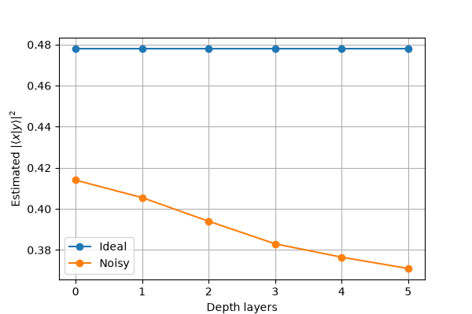

# Week 2: Quantum Similarity & Noise Sensitivity
The second week's assignment focuses on vector similarity via quantum overlaps and on how noise and circuit depth affect
results.
## Task 1 : Inner Products & Classical Comparison
Estimate the squared overlap |⟨x|y⟩|2
for several vector pairs using a swap test, and compare to
classical metrics.
### Results
|           | Squared Overlap | Cosine Similarity | Euclidian Distance |
| ----------| ----------------|-------------------|------------------- |
| identical | 1.0             | 1.0               | 0.0                |
| orthogonal| 0.012           | 0.0               | 1.414              |
| opposite  | 1.0             | -1.0              | 2.0                |
### Interpretation
 Swap test returns |⟨x|y⟩|2 (magnitude squared), cosine similarity is not squared and keeps sign information. In particular, (1, 0) and (−1, 0) have cosine similarity −1, but the same quantum
state up to global phase, so the overlap is 1. For the orthogonal pair, cosine similarity and squared overlap are both approximately zero, with squared overlap containing some noise. 
## Task 2: Tiny Quantum Classifier
Use the overlap estimator from Task 1 as a very small nearest-prototype classifier, and
compare it to a classical cosine-similarity classifier. The two classes are c0 = (1.0, 0.0), c1 = (0.0, 1.0).
### Results
| x          | Agreement | Overlap Squared Label | Cosine Label |
| -----------|-----------|-----------------------|--------------------------|
| (1.0, 0.0) | Yes       | ('0', 1.0, 0)         | ('0', 1.0, 0.0)
| (0.8, 0.2) | Yes       | ('0', 0.9475, 0.0425) | ('0', 0.9701, 0.2425)
| (0.2, 0.8) | Yes       | ('1', 0.0465, 0.946)  | ('1', 0.2425, 0.9701)
| (0.0, 1.0) | Yes       | ('1', 0, 1.0)         | ('1', 0.0, 1.0)
| (1.0, 1.0) | No        | ('1', 0.4755, 0.495)  | ('None', 0.7071, 0.7071)
| (1.0, -1.0 | Yes       | ('0', 0.516, 0.489)   | ('0', 0.7071, -0.7071)
### Interpretation
Both classifiers compare on different notions of similarity. Cosine Similarity compares directions, while the quantum classifier compares squared magnitudes
and looses sign information. The classifiers agree in most cases, except if (i) x is equally similar to both classes or (ii) The direction of x is opposite to a class vector.
In case (i), cosine similarity assigns no class label, whereas the quantum classifier assigns equal similarity to both and the noise steers the result more towards one class.
In case (ii), cosine similarity would be -1 and squared overlap would be 1 due to the loss of sign information.
## Task 3: The Swap Test
Show how overlap estimation degrades with increasing circuit depth under a depolarizing noise
model
### Results

With more layers, noise accumulates and the overlap estimation decreases.
